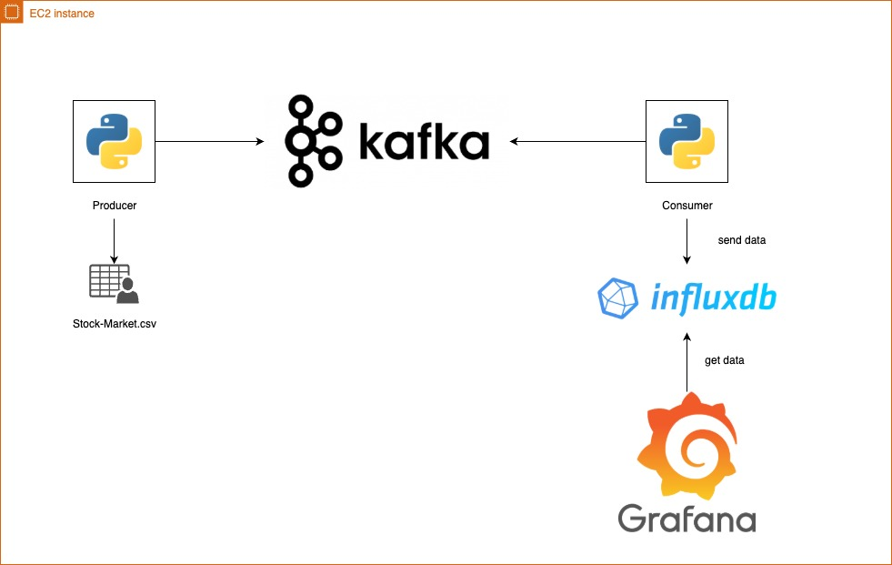
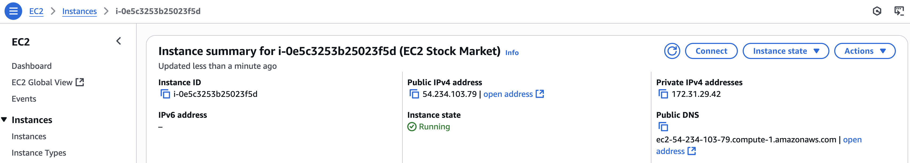
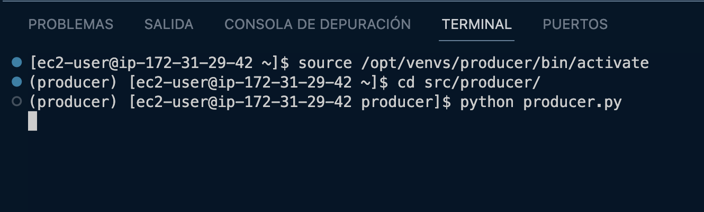
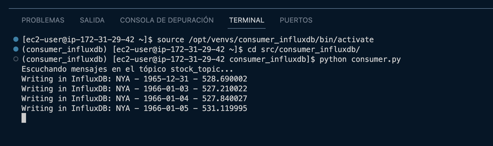
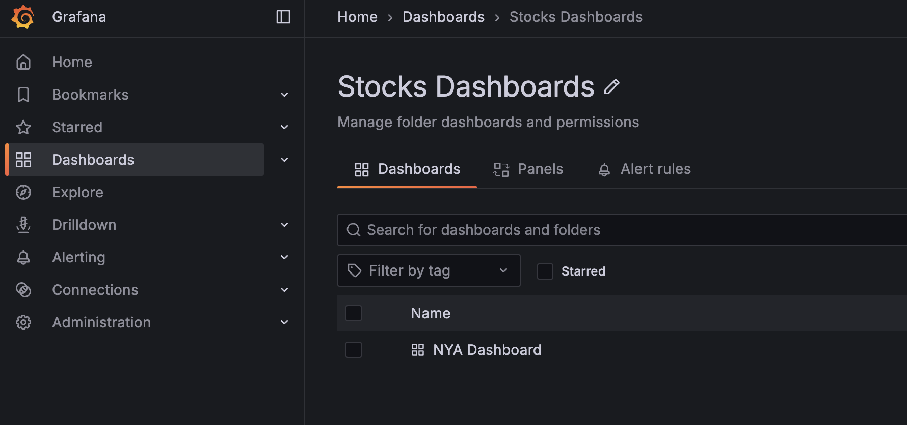
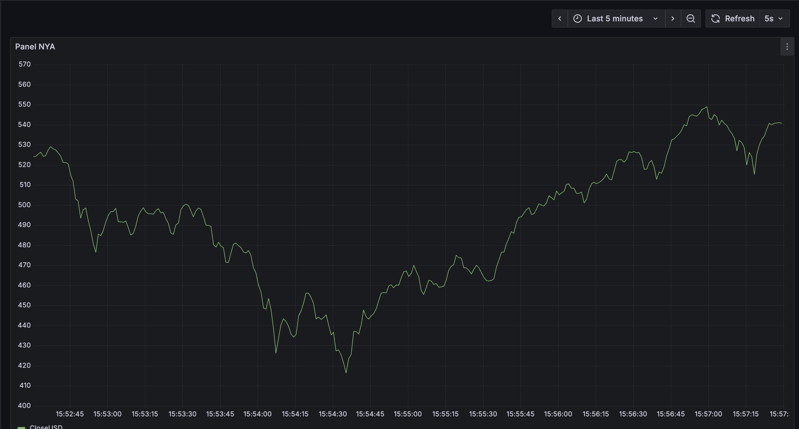

# Stock Market Data Pipeline with Kafka, InfluxDB, and Grafana

This project sets up a data pipeline on an EC2 instance using Kafka, InfluxDB, and Grafana. A Kafka topic receives stock market data produced by a Python application, which is then consumed and stored in InfluxDB. Finally, the data is visualized in Grafana dashboards. The entire setup is automated with Terraform for infrastructure provisioning and Ansible for configuration management.

---

## Project Architecture


## EC2 Diagram



## Technologies Used

- **Terraform:** Provisions the infrastructure on AWS, including the EC2 instance, security groups, and key pairs.
- **Ansible:** Configures the EC2 instance by installing dependencies, deploying code, and setting up Kafka, InfluxDB, and Grafana.
- **Python:** Implements the Kafka producer and consumer applications.
- **Kafka:** Acts as the message broker to handle streaming stock market data
- **InfluxDb:** Stores the stock market data in a time-series database
- **Grafana:** Provides dashboards to visualize the stock market data
- **AWS:** Cloud provider for the infrastructure.

---

## 🛠️ Prerequisites

Before starting, make sure you have the following installed on your local machine:

- [Terraform](https://developer.hashicorp.com/terraform/install)
- [Ansible](https://docs.ansible.com/ansible/latest/installation_guide/intro_installation.html)
- [AWS CLI](https://docs.aws.amazon.com/cli/latest/userguide/install-cliv2.html)
- AWS credentials configured at `~/.aws/credentials`

---

## Usage

### 1. Deploy the stack

Run the following script to:

- Create AWS infrastructure using Terraform
- Configure the EC2 instance using Ansible

```bash
sh deploy.sh
```

### 2. Connect with your ec2 instance

- Go to aws console and locate your ec2 instance
- Copy the SSH connection string provided by AWS.
- In your Terraform directory, you will find the generated-key.pem file.
- Use the following command to connect:

```
ssh -i generated-key.pem ec2-user@<your-ec2-public-ip>
```



### 3. Execute producer

```
source /opt/venvs/producer/bin/activate
cd src/producer/
python producer.py
```



### 4. Execute consumer

```
source /opt/venvs/consumer_influxdb/bin/activate
cd src/consumer_influxdb/
python consumer.py
```



## 📬 Output

Once deployed, access Grafana at http://<your-ec2-public-ip>:3000 to explore the dashboard displaying stock market.




## 🧹 Destroying the Infrastructure

To tear down all AWS resources:

```bash
terraform destroy
```
